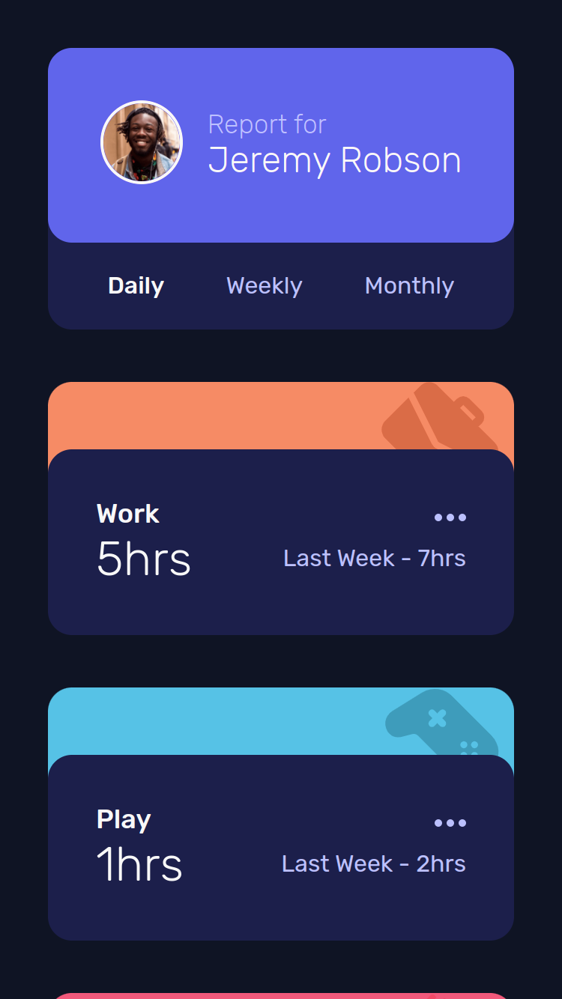
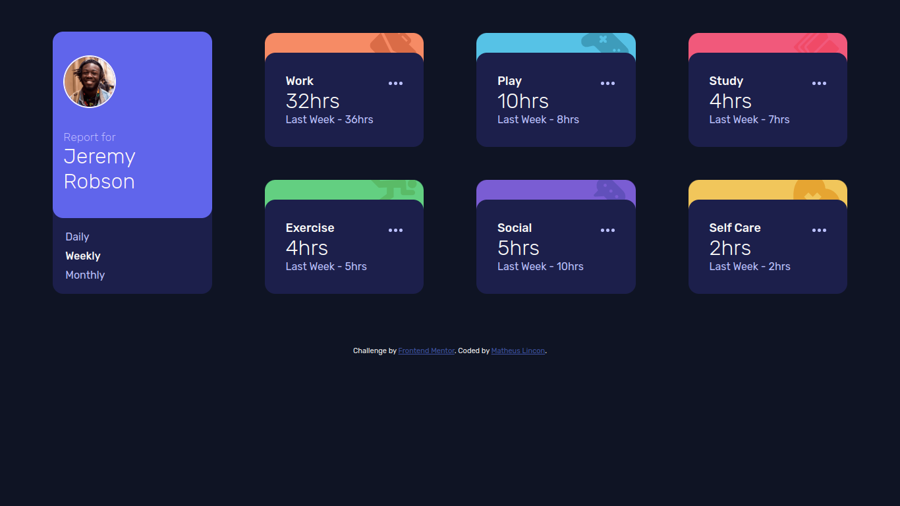

# Frontend Mentor - Time tracking dashboard solution

This is a solution to the [Time tracking dashboard challenge on Frontend Mentor](https://www.frontendmentor.io/challenges/time-tracking-dashboard-UIQ7167Jw). Frontend Mentor challenges help you improve your coding skills by building realistic projects.

## Table of contents

- [Overview](#overview)
  - [The challenge](#the-challenge)
  - [Screenshot](#screenshot)
  - [Links](#links)
- [My process](#my-process)
  - [Built with](#built-with)
  - [What I learned](#what-i-learned)
- [Author](#author)

## Overview

### The challenge

Users should be able to:

- View the optimal layout for the site depending on their device's screen size
- See hover states for all interactive elements on the page
- Switch between viewing Daily, Weekly, and Monthly stats

### Screenshot

### Links

- Live Site URL: [Time Tracking Dashboard](https://matheus-lincon.github.io/time-tracking-dashboard)

## My process

### Built with

- Semantic HTML5 markup
- CSS
  - Grid
  - Flexbox
  - Position absolute & relative
- Mobile-first workflow
- JavaScript
  - Fetch

### What I learned

In this challenge I was able to practice more CSS Grid.
I also practice more about **fetch** and how to use it.

## Author

- Frontend Mentor - [@matheus-lincon](https://www.frontendmentor.io/profile/matheus-lincon)
- GitHub - [@matheus-lincon](https://www.github.com/matheus-lincon)
- LinkedIn - [@matheus.lincon.10010](https://www.linkedin.com/in/matheus-lincon-10010)
